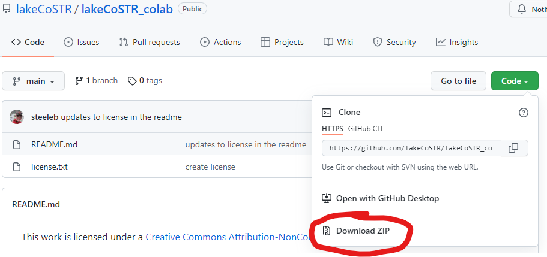
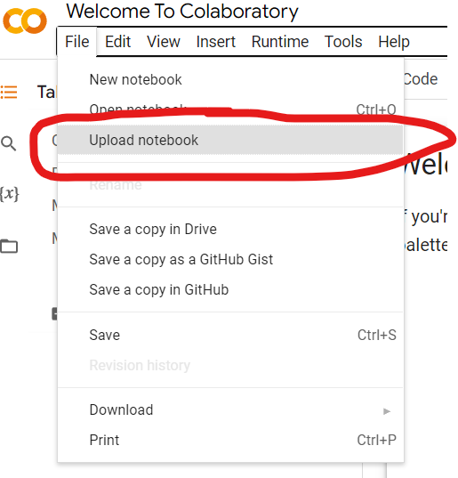

# lakeCoSTR User Guide

We created lakeCoSTR to make the acquisition and analysis of Landsat's Collection 2 Surface Temperature product more accessible for those interested in obtaining historical estimates of lake temperature from remote sensing data. This tool is geared towards researchers interested in gathering historical temperature estimates, especially for small lakes, who don't necessarily have experience working with remote sensing data. This tool leverages Google Earth Engine (GEE) (Gorelick, et al. 2017), the GEE Python API, and Google Colaboratory (Bisong, 2019).

You must have <a href="https://support.google.com/accounts/answer/27441?hl=en" target="_blank">Google Account</a> and <a href="https://signup.earthengine.google.com/" target="_blank">Google Earth Engine Credentials</a> in order to use this tool.

lakeCoSTR is an open-source tool, but please cite accordingly - the widget provided on the right side of the  will provide a citation. 

## Features of lakeCoSTR

__lakeCoSTR aggregates the surface temperature estimates into summary values per Landsat scene and outputs those data in a single *.csv* file for the requested time of interest__
 - The tool provides summary statistics for each scene, including mean estimated temperature, five-number summary of the estimated temperature, skew, and distrubution kurtosis
 - The tool also provides histograms of each Landsat scene for users to visually examine the spread and distribution of pixel-level data to assist the user in choosing a meaningful summary statistic and aid in further data filtering

__lakeCoSTR makes it easy to pair the Landsat surface temperature estimates with user-provided *in situ* temperature data__
 - We HIGHLY RECCOMMEND that users create a Landsat-*in situ* dataset at this time prior to applying any Landsat-derived temperature estimate to their ecological question, as large-scale evaluation of Collection 2 temperature estimates for lakes has not yet been completed. For information about current validation practices of Collection 2 data by NASA, please see Cook 2014.

## Constraints and Caveats 

__lakeCoSTR works best for small lakes__
 - small lakes are usually completely contained within one or more <a href = "https://landsat.gsfc.nasa.gov/about/the-worldwide-reference-system/" target="_blank">WRS-2 path rows</a>. lakeCoSTR does not aggregate data between multiple Landsat path-rows. Users will be messaged in the tool if there are issues with this
 - small lakes require a smaller amount of cloud compute power and are less likely to time-out the Google Earth Engine API within the tool. If a compute time-out occurs, users will be notified of how to troubleshoot within the tool
 - lake-of-interest must have a surface area of at least 0.4ha or approximately 42 30x30m pixels large for lakeCoSTR to provide meaningful summary statistics.

__lakeCoSTR works best for non-connected lakes__
 - the automatic delineation tool used in lakeCoSTR will include streams and connected waterbodies within the user-drawn bounding box if they are connected by a water pixels visible by Landsat's 30x30m pixel size. If you are interested in using lakeCoSTR for an area smaller than is automatically delineated by the tool, you may upload a shapefile or vector file to override the automatic delineation.

__lakeCoSTR was only designed to extract surface temperature for lakes during ice-free periods__
 - all pixels that have been labeled as 'ice' or 'snow' will be filtered from the scene if present and flagged in the Bit Quality Assessment (BQA) band of the scene metadata

__lakeCoSTR may not perform well at high latitudes__
 - there is currently no solar zenith angle cutoff employed in the lakeCoSTR tool: this may result in distortions of temperature estimates and location precision
 - solar zenith angle, as provided in the Landsat scene metadata is included in the output *.csv*

## If you've never used Colab:

Visit the  webpage and run through the script that pops up on this page. It will walk your through how to use a Colab Notebook!

## Using the lakeCoSTR

### Open the tool 

There are two primary ways to open the lakeCoSTR tool in Google Colaboratory:

#### 1) if you __DO__ have a GitHub account:
    
a) simply fork the lakeCoSTR_colab repository, navigate to the lakeCoSTR.ipynb notebook and click the 'Open in Colab' link at the top of the file (circled below in RED)
    

b) In the Colab browser, click 'File' -> 'Save a copy in Drive' - this will save a copy of the lakeCoSTR tool to your Google Drive in a folder called 'Colab Notebooks'.
    

#### 2) if you __DO NOT__ have a GitHub account:
    
a) on the landing page of the repository, click the green button labeled 'Code' and choose the option 'Download ZIP'. This will download the reopository to your computer.
    

b) unzip the folder

c) navigate to 

d) In the Colab browser, upload the lakeCoSTR.ipynb file from the downloaded repository by clicking 'File' -> 'Upload Notebook':
    

e) In the Colab browser, click 'File' -> 'Save a copy in Drive' - this will save a copy of the lakeCoSTR tool to your Google Drive in a folder called 'Colab Notebooks'.
    

*Citations:*

Bisong, Ekaba. 2019. “Google Colaboratory.” In Building Machine Learning and Deep Learning Models on Google Cloud Platform: A Comprehensive Guide for Beginners, edited by Ekaba Bisong, 59–64. Berkeley, CA: Apress. https://doi.org/10.1007/978-1-4842-4470-8_7.

Cook, M. (2014). Atmospheric Compensation for a Landsat Land Surface Temperature Product. Thesis. Rochester Institute of Technology. Accessed from http://scholarworks.rit.edu/theses/8513.

Gorelick, Noel, Matt Hancher, Mike Dixon, Simon Ilyushchenko, David Thau, and Rebecca Moore. 2017. “Google Earth Engine: Planetary-Scale Geospatial Analysis for Everyone.” Remote Sensing of Environment, Big Remotely Sensed Data: tools, applications and experiences, 202 (December): 18–27. https://doi.org/10.1016/j.rse.2017.06.031.

